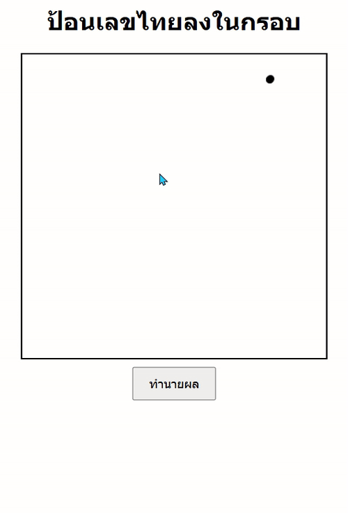

## OCR Thai Number
  
  <br>
  <br>
  This is an Optical Character Recognition (OCR) with a Convolutional Neural Network to predict Thai numeral handwriting. To conduct this project, handwriting was collected from students in the Faculty of Engineering, at Khon Kaen University.
  <br>
  <br>
  Thank you Dataset By -> Suriyachat Golf
  <br>
  <br>
  If you'd like to use it, you should install this. <br>
  
  ```
  $ pip install -r requirements.txt
  ```
> [!IMPORTANT]
> recommended to use Python 3.9._
  <br>
  <br>
  
  If you have everything installed, Open a file named app.py and run it.
  ```
  $ python app.py
  ```
  <br>
  If there are no errors, the program will display this window.<br>
   


